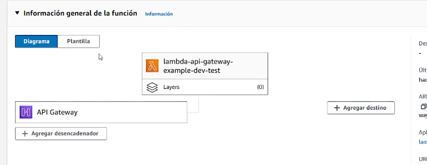

<div align="center">

<div align="right">


</div>
</div>

<br>

<br>

<div align="right">
  <a href="../README.md" title="Español">
    
  </a>
  <a href="./README.en.md" title="Inglés">
    
  </a>
</div>

<br>

<div align="center">

# Lambda_Api_Gateway_Serverless_AWS_Example 

</div>

A Lambda to publish your first API on AWS. It brings API Gateway and Node.js together in an HTTP endpoint, declared with Serverless and with the deploy prepared for GitHub Actions, so you go from code to a URL that already responds and can repeat that path each time you update the project.

<div align="left">
<a href="https://www.youtube.com/playlist?list=PLCl11UFjHurBhSQCwGDw7uDd2yAu5tVsV" target="_blank" rel="noopener noreferrer" title="Playlist"></a>
</div>

<br>

## Index 📜

<details>
 <summary>View details</summary>

<div align="right">

`Last update: 27/09/26`

</div>

### Section 1) Description, setup, and technologies.

* [1.0) Description.](#10-description-)
* [1.1) Running the project.](#11-running-the-project-)
* [1.2) Technologies.](#12-technologies-)

### Section 2) Documentation and references.

* [2.0) Documentation and references.](#20-documentation-and-references-)

</details>

<br>

## Section 1) Description, setup, and technologies.

### 1.0) Description [🔝](#index-)

<details>
 <summary>View details</summary>

* The service is defined in `serverless.yml`: one Lambda function (`test`) on the Node.js 20 runtime, with 128 MB of memory, a 10-second timeout, and the `us-east-2` region. The provider declares 512 MB; the function uses 128 MB.
* API Gateway publishes `GET /test` as an HTTP API.
* The handler lives in `src/index.js`. It receives the event, writes it to the log, and responds `200` with `{ message: 'Lambda with Api Gateway!' }`.
* Deploy is prepared in `.github/workflows/master.yml`. The workflow is commented out. Once enabled, every push to `master` installs Node.js 20 and publishes the service with the Serverless Framework.

</details>

### 1.1) Running the project [🔝](#index-)

<details>
 <summary>View details</summary>

* Clone the repository and open the folder.

```bash
git clone https://github.com/andresWeitzel/Lambda_Api_Gateway_Serverless_AWS_Example.git
cd Lambda_Api_Gateway_Serverless_AWS_Example
```

* Node.js 20 is required. It is the same runtime the function uses.
* The project does not declare application dependencies. The lockfile is empty, and `npm ci` leaves the environment ready for the workflow.
* Deploy goes through GitHub Actions. In `.github/workflows/master.yml` the job is commented out. After uncommenting it, a push to `master` runs `serverless deploy` with `serverless/github-action@v3.2`.
* The workflow reads credentials from the repository secrets: `AWS_ACCESS_KEY_ID` and `AWS_SECRET_ACCESS_KEY`.

</details>

### 1.2) Technologies [🔝](#index-)

<details>
 <summary>View details</summary>

| **Technology** | **Version** | **Use** |
| --- | --- | --- |
| [Node.js](https://nodejs.org/) | 20.x | Function runtime |
| [AWS Lambda](https://docs.aws.amazon.com/lambda/latest/dg/welcome.html) | — | Execution in `us-east-2` |
| [API Gateway](https://docs.aws.amazon.com/apigateway/latest/developerguide/http-api.html) | HTTP API | `GET /test` endpoint |
| [Serverless Framework](https://www.serverless.com/framework/docs) | GitHub Action 3.2 | Service definition and deploy |
| [GitHub Actions](https://docs.github.com/actions) | — | Publish with the `master` workflow |
| [Git](https://git-scm.com/) | — | Version control |

</details>

<br>

## Section 2) Documentation and references.

### 2.0) Documentation and references [🔝](#index-)

<details>
 <summary>View details</summary>

#### AWS

* [AWS Lambda documentation](https://docs.aws.amazon.com/lambda/latest/dg/welcome.html)
* [AWS Lambda with Node.js](https://docs.aws.amazon.com/lambda/latest/dg/lambda-nodejs.html)
* [API Gateway HTTP API](https://docs.aws.amazon.com/apigateway/latest/developerguide/http-api.html)

#### Serverless Framework

* [Framework documentation](https://www.serverless.com/framework/docs)
* [Serverless AWS guide](https://www.serverless.com/framework/docs/providers/aws/guide/intro)
* [HTTP API events](https://www.serverless.com/framework/docs/providers/aws/events/http-api)
* [Serverless GitHub Action](https://github.com/serverless/github-action)

#### Repository and CI

* [GitHub Actions documentation](https://docs.github.com/actions)
* [Node.js 20 documentation](https://nodejs.org/docs/latest-v20.x/api/)
* [Git documentation](https://git-scm.com/doc)

#### Learning

* [AWS Serverless playlist](https://www.youtube.com/playlist?list=PLCl11UFjHurBhSQCwGDw7uDd2yAu5tVsV)

</details>
